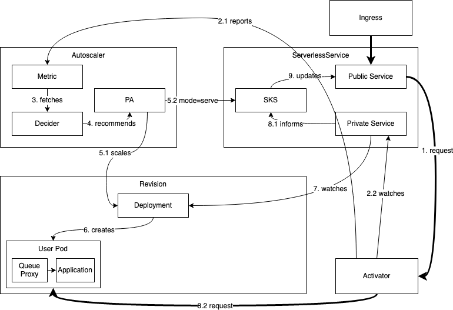
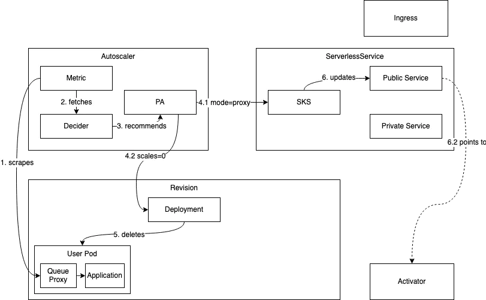

# 方案1
## 实现方式
[knative简介](https://github.com/ysjjovo/knative-tutorial)。所有应用按照knative的方式部署(创建knative service),会自动生成ingress，revision,deployment，流量完全走knative核心。
- 0-1流程

- 1-0流程

这里需要解决网关适配问题[apisix ingress](https://github.com/fhuzero/apisix-ingress-controller/blob/feat/knative-support/docs/en/latest/practices/knative-support.md)

- 痛点：
整个系统有很多组件,排查问题及深入研究代价高
spring等项目启动需要几十秒到1分钟不等，这段时间内无法处理请求。
- 优点：
扩展性强,结合云主机的弹性伸缩,资源利用率最大化,极大减少基础设施成本
前沿领域，可想像空间多，可以结合物联网等边缘计算场景

# 方案2
## 实现方式
基于activator开发,移除其它组件，直接拉起应用，指标不上报autoscaler，计算后判断是否删除应用。

# 方案3
## 实现方式
- 改造网关，用插件到方式捕获到后端服务不可用，然后修改deployment来实现。
这种方式前面部分请求会失败（分钟级）
- 缓存请求,判断服务可用再实现转发，需要修改apisix/openresty/nginx源码支持请求缓冲(改动可能很大，c写的)
[openresty流程](https://www.zhuyanbin.com/?p=688)
